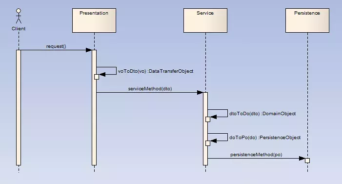

+++
title = "Spring Boot下的VO, PO, DO, DTO, BO, DAO, POJO"
date = 2022-01-12 10:53:41
slug = "202201121053"

[taxonomies]
tags = ["Spring Boot", "Spring" ]
categories = ["Spring"]

+++

<!-- more -->

## 概念

[VO, PO, DO, DTO, BO, QO, DAO, POJO concept - Code World (codetd.com)](https://www.codetd.com/en/article/12351967)

**VO（View Object）**：视图对象，用于展示层，它的作用是把某个指定页面（或组件）的所有数据封装起来。

**PO（Persistent Object）**：持久化对象，它跟持久层（通常是关系型数据库）的数据结构形成一一对应的映射关系，如果持久层是关系型数据库，那么，数据表中的每个字段（或若干个）就对应PO的一个（或若干个）属性。

**DO（Domain Object）**：领域对象，就是从现实世界中抽象出来的有形或无形的业务实体。

**DTO（Data Transfer Object）**：数据传输对象，这个概念来源于J2EE的设计模式，原来的目的是为了EJB的分布式应用提供粗粒度的数据实体，以减少分布式调用的次数，从而提高分布式调用的性能和降低网络负载，但在这里，我泛指用于展示层与服务层之间的数据传输对象。

**BO(Business Object)**：业务对象，业务对象的主要功能是将业务逻辑封装为对象。此对象可以包括一个或多个其他对象。封装业务逻辑的 Java 对象可以通过调用 DAO 方法与 PO 和 VO 一起执行业务操作。例如，一份简历，具有教育经验，工作经验，社会关系等。我们可以对应教育经验的PO，工作经验的PO和社会关系的PO。创建与简历对应的 BO 对象以处理简历，并且每个 BO 都包含这些采购订单。当以这种方式处理业务逻辑时，我们可以使用BO。

**POJO (Plain Ordinary Java Object)** ：简单和不规则的 java 对象，纯传统 Java 对象。也就是说，在某些对象/关系映射工具中，可以维护数据库表记录的持久对象完全是符合Java Bean规范的纯Java对象，无需添加其他属性和方法。我的理解是，最基本的Java Bean只有属性字段和setter和getter方法。

**DAO (Data Access Object)：** 数据访问对象，是 Sun 的标准 J2EE 设计模式。此模式中的接口之一是 DAO，它对持久性层进行负操作。为业务层提供接口。此对象用于访问数据库。DAO通常与PO结合使用，包含各种数据库操作方法。通过其方法，结合PO对数据库执行相关操作。夹在业务逻辑和数据库资源之间。配合VO，提供数据库CRUD操作.

## 模型

示例：

- 用户发出请求（可能是填写表单），表单的数据在展示层被匹配为VO。

- 展示层把VO转换为服务层对应方法所要求的DTO，传送给服务层。

- 服务层首先根据DTO的数据构造（或重建）一个DO，调用DO的业务方法完成具体业务。

- 服务层把DO转换为持久层对应的PO（可以使用ORM工具，也可以不用），调用持久层的持久化方法，把PO传递给它，完成持久化操作。
